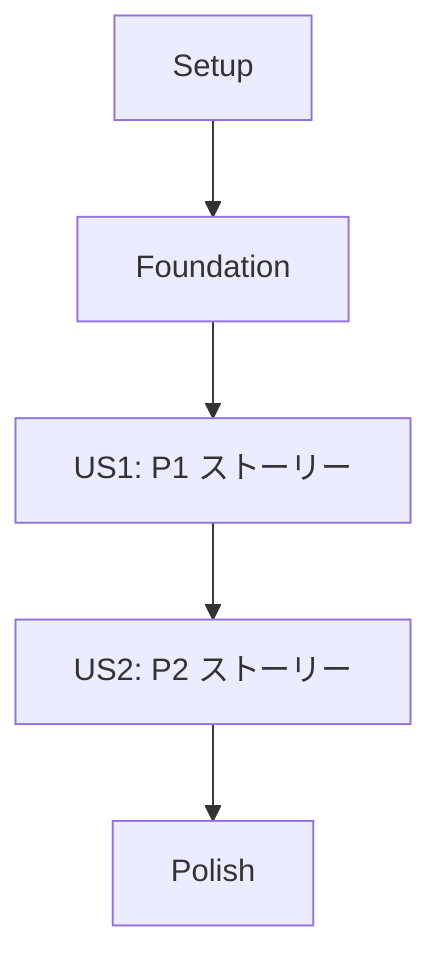

# タスクリスト: [プロジェクト/機能名]

**作成日**: [DATE]
**設計書参照**: `docs/design/`
**要件定義書参照**: `docs/requirements/`

## 凡例

| 記号 | 意味 |
|------|------|
| `T001` | タスク ID（全フェーズ通し連番、3 桁ゼロ埋め） |
| `[P]` | 並列実行可能（他のタスクと同時に着手できる） |
| `[US1]` | ユーザーストーリー紐づけ（US1 = P1 ストーリー、US2 = P2 ストーリー…） |

## ユーザーストーリーマッピング

| 記号 | ストーリー名 | 優先度 | 対応 functional ファイル |
|------|------------|--------|------------------------|
| US1  | [P1 ストーリー名] | P1 | functional/[機能名].md |
| US2  | [P2 ストーリー名] | P2 | functional/[機能名].md |

## 依存関係グラフ

## 実装戦略

- **MVP スコープ**: Phase 1 + Phase 2 + Phase 3（P1 ストーリーのみ）が完成した時点で MVP
- **段階的リリース**: P2 以降のストーリーは MVP 確認後に着手
- **並列化機会**: Foundation フェーズ内のバックエンド・フロントエンドは並列着手可能

---

## Phase 1: Setup（プロジェクト初期構築）

- [ ] T001 リポジトリ構成・ビルド設定を確認し、開発環境を起動できる状態にする
- [ ] T002 [P] DB マイグレーション実行基盤を設定する
- [ ] T003 [P] CI パイプライン（ビルド・テスト）の初期設定を確認する

## Phase 2: Foundation（全ストーリーの前提となる横断実装）

- [ ] T004 共通 ErrorResponse・例外ハンドラを実装する（共通部品設計.md 参照）
- [ ] T005 [P] JWT 認証フィルタ・セキュリティ設定を実装する（セキュリティ設計.md 参照）
- [ ] T006 [P] 共通バリデーション基盤を実装する

## Phase 3: [P1 ストーリー名]（優先度: P1）

**独立テスト**: [functional/*.md の独立テスト内容をここに転記]

### テーブル

- [ ] T007 [P] [US1] [テーブル名] テーブルの DDL・マイグレーションファイルを作成する（tables/[テーブル名].md 参照）

### バックエンド

- [ ] T008 [P] [US1] [エンティティ名] Entity クラスを実装する
- [ ] T009 [P] [US1] [エンティティ名] Repository を実装する
- [ ] T010     [US1] [機能名] Service を実装する（api/[リソース名].yaml の operationId 参照）
- [ ] T011 [P] [US1] [リソース名] Controller を実装する

### フロントエンド

- [ ] T012 [P] [US1] [画面名] 画面コンポーネントを実装する（screens/SCR-XXX-[画面名].md 参照）
- [ ] T013 [P] [US1] [画面名] API クライアントを実装する

## Phase N: [P2 ストーリー名]（優先度: P2）

（Phase 3 と同様の構成。[US2] ラベルを使う）

## Final Phase: Polish & 横断関心事

- [ ] T0NN エラー/空状態/ローディング UI の統一確認
- [ ] T0NN セキュリティレビュー観点の最終確認（セキュリティ設計.md 参照）
- [ ] T0NN カバレッジ・静的解析の確認
