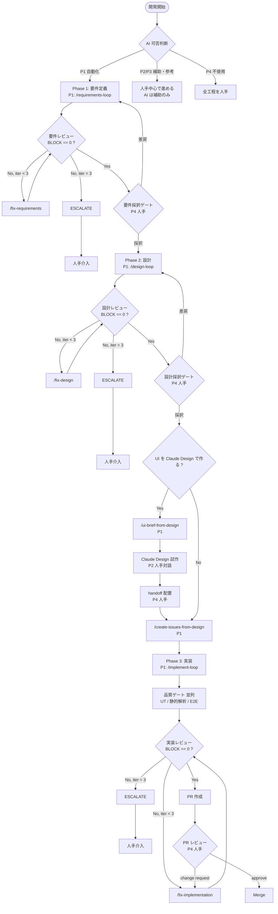

# ④ 開発フロー更新

最終更新: 2026-05-27

本文書は、①プロンプト生成ルール・②AI 成果物レビュー基準・③AI 利用シーン整理を踏まえ、`CLAUDE.md` の開発フローを **どう運用するか** を再定義します。`CLAUDE.md` 本体の規約と矛盾せず、運用ガイドとして補完する位置づけです。

---

## 1. 更新の狙い

| 観点 | 従来 | 更新後 |
|------|------|--------|
| 関与度の明示 | skill の流れだけ記述 | 各工程に **P1〜P4** を割り当て（[03 §1](03-ai-usage-scenes.md#1-利用パターンの分類)） |
| レビュー観点 | review skill 内に分散 | フェーズ × 観点マトリクスで統一（[02 §2](02-review-criteria.md#2-フェーズ--観点マトリクス)） |
| プロンプト規約 | skill ごとに個別 | 共通テンプレ + アンチパターン集（[01 §2](01-prompt-rules.md#2-プロンプト構造のテンプレート)） |
| ESCALATE 時の出口 | 「人手介入」とのみ記載 | 切り分け手順を文書化（[02 §5.1](02-review-criteria.md#51-escalate-時の人手対応)） |
| メトリクス | 未整備 | KPI / SLO を [§5](#5-メトリクスとkpi) で定義 |

---

## 2. 全体フロー図

> 黄色の判断（マークダウン上は表現できないが、`Adopt*` / `Review`）は **すべて P4（人手）**。

---

## 3. フェーズ別運用詳細

### 3.1 Phase 1: 要件定義

| 項目 | 内容 |
|------|------|
| トリガー | `/requirements-loop <要件素材ファイル>` |
| produce | `/requirements-from-input`（P1） |
| review | `/review-requirements`（P1） |
| fix | `/fix-requirements`（P1） |
| 採択ゲート | **人手必須**。`docs/requirements/` の各文書を読み、open-questions の解決方針に合意 |
| 成功基準 | BLOCK == 0 かつ採択 |
| 失敗時 | ESCALATE → open-questions に未解決事項を転記し、関係者と合意 |

確認するレビュー観点: completeness / consistency / traceability / ambiguity / security（[02 §2](02-review-criteria.md#2-フェーズ--観点マトリクス)）。

### 3.2 Phase 2: 設計

| 項目 | 内容 |
|------|------|
| 前提 | Phase 1 採択完了 |
| トリガー | `/design-loop [docs/requirements/]` |
| produce | `/design-from-requirements`（P1） |
| review | `/review-design`（P1） |
| fix | `/fix-design`（P1） |
| 採択ゲート | **人手必須**。標準スタック準拠、性能・運用要件、将来の拡張可能性 |
| 成功基準 | BLOCK == 0 かつ採択 |
| 失敗時 | ESCALATE → 要件側に戻すか、設計判断を人手で確定 |

留意点: 設計時に要件意思決定をしない（CLAUDE.md「開発ルール」）。判断が必要になったら採択ゲートで要件に差し戻す。

> 設計成果物に含まれる `docs/design/テスト戦略.md` と `docs/design/シナリオ戦略.md` は **テスト工程 T1** に相当する。詳細は [05-test-process.md §1](05-test-process.md#1-テスト工程の全体像) を参照。

### 3.3 Phase 2.5: UI（任意）

| 項目 | 内容 |
|------|------|
| 前提 | Phase 2 採択完了 |
| 流れ | `/ui-brief-from-design`（`_共通.md` + 画面別 md を生成）→ Claude Design に共通 → 画面別の順で投入 → 対話 → Export → `docs/design/ui-design/handoff/` に **Export 構造そのまま** 手動配置（README.md / prototype/ / tokens/） |
| 採択ゲート | **人手必須**。ブランドガイドライン適合、画面遷移整合 |
| 注意 | 設計書本体（`docs/design/screens/` 等）は書き換えない |

### 3.4 Phase 3: Issue 起票

| 項目 | 内容 |
|------|------|
| 前提 | Phase 2 / 2.5 採択完了 |
| トリガー | `/create-issues-from-design [docs/design/]` |
| 出力 | GitHub Issues（screen / API リソース / interface / table 単位） |
| 採択ゲート | 軽量レビュー（タイトル規約・ラベル・関連設計書リンクの整合） |
| 注意 | 優先順・スプリント割当は人手で実施 |

> Issue 起票後のラベル運用・ステータス遷移・依存関係表現・レビュー結果の記録は [06-issue-management.md](06-issue-management.md) を参照。

### 3.5 Phase 4: 実装

| 項目 | 内容 |
|------|------|
| トリガー | `/implement-loop <ISSUE-NUMBER>` |
| produce | `/implement-from-issue`（P1。内部で品質ゲートを Pattern 2 並列） |
| review | `/review-implementation`（P1） |
| fix | `/fix-implementation`（P1。同一 feature ブランチへ追加コミット） |
| PR レビュー | **人手必須**。設計意図反映・テスト十分性・運用観点 |
| マージ判断 | **人手必須** |

品質ゲートの並列構成: UT（`/unit-test-from-design`）／静的解析（`/static-analysis-remediation`）／E2E（`/e2e-from-design`）の 3 つを並列起動し、すべて成功するまで次へ進まない。失敗時は `failure-investigator` を起動して根本原因を切り分ける。

> Phase 4 のテスト関連の運用（テスト種別の責務分離、テスト成果物構造、カバレッジ改善、E2E 留意点）は [05-test-process.md](05-test-process.md) に集約。本フェーズではテスト工程の **T3（生成・実行）** と必要時の **T4（カバレッジ改善）** が回る。

---

## 4. 人手レビューゲートの再定義

人手レビューは「形式チェック」を AI に委ね、**判断系のみに集中** する。

| ゲート | タイミング | 主観点 | 出力 |
|--------|------------|--------|------|
| 要件採択 | Phase 1 完了後 | スコープ・優先順・open-questions 解決 | `docs/requirements/` 承認、または差戻 |
| 設計採択 | Phase 2 完了後 | 標準スタック・性能・運用・拡張性 | `docs/design/` 承認、または差戻 |
| UI 採択 | Phase 2.5 完了後 | ブランド・UX・遷移整合 | handoff 配置承認 |
| PR レビュー | Phase 4 PR 作成後 | 設計反映・テスト・運用観点 | approve / change request |
| マージ判断 | PR approve 後 | リリース影響・リスク | merge / hold |
| ESCALATE 介入 | 各 loop で iteration 上限到達時 | 未解決 BLOCK の切り分け | 修正方針 / 要件への差戻 |

人手レビュアは AI レビューのラベル（BLOCK/SUGGEST/NIT）を継承して指摘する（[02 §4.2](02-review-criteria.md#42-人手レビュー必須ゲート)）。

---

## 5. メトリクスと KPI

AI 駆動開発の効果を定量化し、改善サイクルを回すための指標。

### 5.1 効率指標

| 指標 | 定義 | 目標値（初期） |
|------|------|----------------|
| **リードタイム（フェーズ別）** | フェーズ開始から採択完了までの時間 | 要件 ≤ 1d、設計 ≤ 2d、実装 1 Issue ≤ 0.5d |
| **AI 自動化率** | P1 工程の所要時間 / 全工程の所要時間 | ≥ 70% |
| **ループ反復回数（平均）** | フェーズ別の平均 iteration 数 | ≤ 1.5 |
| **ESCALATE 率** | フェーズ完了のうち ESCALATE で終わった割合 | ≤ 10% |

### 5.2 品質指標

| 指標 | 定義 | 目標値（初期） |
|------|------|----------------|
| **初稿 BLOCK 件数（平均）** | round-1-review.json の BLOCK 数 | ≤ 3 / フェーズ |
| **人手レビュー追加指摘率** | 人手レビューで新たに見つかった BLOCK の件数 / AI BLOCK 件数 | ≤ 20% |
| **本番障害率（リリース後 30 日）** | リリース後 30 日以内の障害 / リリース機能数 | 単調減少を目標 |
| **カバレッジ達成率** | 規定閾値を満たした PR の割合 | ≥ 95% |

### 5.3 計測の置き場

- `.skills-state/<phase>/state.json` の `history` 配列に各 iteration の review メタが残る。これを集計。
- 人手指摘は PR レビューコメントに `[BLOCK]` / `[SUGGEST]` のラベルを付け、GitHub API で集計。
- 月次で `docs/process/metrics/YYYY-MM.md` に集計結果を残す（運用が立ち上がったら追加）。

---

## 6. AI 可否判断の組み込み

新規工程・新規 skill を導入する際、[03 §4](03-ai-usage-scenes.md#4-ai-可否の判断フロー) のフローで関与度を決め、結果を skill の frontmatter 直下 or `docs/process/` の追記として残す。これを怠ると、P1 にすべきでないものが自動化されたり、逆に P1 にできるものが人手のままになる。

新規 skill の追加チェックリスト:

- [ ] 関与度（P1〜P4）が決まっている
- [ ] frontmatter が [01 §2.2](01-prompt-rules.md#22-skill-用-frontmatter-テンプレート) のテンプレに沿う
- [ ] `context: fork` の判断が [01 §3.2](01-prompt-rules.md#32-context-fork-の判断基準) に従う
- [ ] 出力が機械可読（必要なら JSON スキーマを明示）
- [ ] `*-loop` への組み込み（必要なら）
- [ ] レビュー観点が [02 §2](02-review-criteria.md#2-フェーズ--観点マトリクス) に追記済み

---

## 7. ノウハウ集

### N-01: 「採択ゲートを軽くしすぎない・重くしすぎない」

軽すぎると後工程に手戻りが波及する。重すぎると AI の高速ループが死ぬ。**「採択後に修正不能なもの」だけを採択基準に置く** のがバランス点（事業判断、スコープ、性能要件など）。

### N-02: 「ESCALATE 率が高いフェーズは要件不足のサイン」

ESCALATE が連発するのは AI のせいではなく、入力（要件 / 設計）の解像度不足が原因のことが多い。前段に戻る判断を躊躇しない。

### N-03: 「skill 追加は必ず文書に反映」

新規 skill を `.claude/skills/` に置くだけだと、運用ガイドから漏れる。[06 のチェックリスト](#6-ai-可否判断の組み込み) を通して、`docs/process/` 側を必ず更新する。

### N-04: 「人手レビューは『判断と運用』に絞る」

形式チェック（誤字・スキーマ違反・カバレッジ）は AI に任せ、人手は事業判断・運用観点・将来拡張に集中する。両方やると人手側が形式チェックに溺れる。

### N-05: 「メトリクスは月次で振り返る」

KPI は計測して終わりではなく、月次の振り返りで「P1 化できるもの」「P4 に戻すべきもの」を再判断する。`docs/process/` の更新ネタはここから出る。

### N-06: 「ループ上限を増やすより、produce / fix の質を上げる」

iteration 上限を 3 → 5 にしても、ESCALATE は減らない。むしろ `requirements-from-input` のプロンプトを磨いたり、`オープン課題.md` の使い方を改善するほうが効く。

---

## 8. 移行と運用

### 8.1 既存プロジェクトへの適用順

1. 本シリーズを通読してチームで合意（[README.md](README.md)）。
2. 既存の skill が [01 のテンプレ](01-prompt-rules.md#22-skill-用-frontmatter-テンプレート) に沿うか確認、差分があれば加算型で更新。
3. レビュー基準（[02](02-review-criteria.md)）を `*-loop` の状態に取り込む。
4. AI 利用シーン（[03](03-ai-usage-scenes.md)）に基づき、新規工程の関与度を判定。
5. 月次でメトリクスを集計し、本シリーズを継続更新。

### 8.2 文書間の責務分担

| 文書 | 役割 |
|------|------|
| `CLAUDE.md` | **最上位の規約**。skill 名・標準スタック・基本ルールの一次情報 |
| `docs/architecture/skill-orchestration.md` | **設計の根拠**。Pattern 2/3/4・state スキーマの実装根拠 |
| `docs/process/0X-*.md` | **運用ガイド**。ガバナンスとノウハウの恒久的な蓄積 |
| `.claude/skills/*/SKILL.md` | **実行可能な命令**。プロンプト本体 |

---

## 9. 関連文書

- [README.md](README.md) — 索引
- [01-prompt-rules.md](01-prompt-rules.md) — プロンプト生成ルール
- [02-review-criteria.md](02-review-criteria.md) — レビュー基準