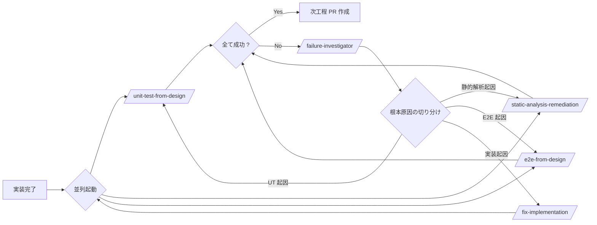

# ⑤ テスト工程

最終更新: 2026-05-27

本文書は、AI 駆動開発における **テスト工程** の運用を独立した観点でまとめます。テストは `CLAUDE.md` 上では `/implement-loop` の品質ゲートとして並列起動されますが、責務としては「設計時の戦略決定」「テスト生成」「テスト実行と修正」「カバレッジ改善」が独立しており、それぞれに専用 skill とノウハウが存在します。

`docs/design/テスト戦略.md` と `docs/design/シナリオ戦略.md` がプロジェクト固有のテスト戦略の正本、本文書は **戦略をどう運用するか（プロセス）** の正本です。

---

## 1. テスト工程の全体像

テスト関連の作業は次の 4 つのサブ工程に分解できる。

| サブ工程 | 主担当 | 関与度 | 主な出力 |
|----------|--------|--------|----------|
| **T1. テスト戦略** | 設計フェーズに同伴 | P1 | `docs/design/テスト戦略.md`、`docs/design/シナリオ戦略.md` |
| **T2. テスト設計（マトリクス・シナリオ）** | 設計採択後 | P1 | `docs/test/単体テストマトリクス.md`、`docs/test/E2Eシナリオ.md` |
| **T3. テスト生成・実行** | 実装フェーズ（品質ゲート並列） | P1 | UT / E2E コード、実行結果、PR |
| **T4. カバレッジ改善** | 必要時 | P1 | 追加テスト、除外記録、改善後カバレッジ数値 |

工程フローへの位置づけは [04 §2 全体フロー図](04-development-flow.md#2-全体フロー図) と整合する。T1 は Phase 2（設計）に内包、T2 は Phase 2 採択後・Phase 4 開始前、T3 は Phase 4 の品質ゲート、T4 は T3 で閾値未達のとき発火。

---

## 2. テスト種別と責務分離

| 種別 | 対象 | 主ツール | 責務範囲 |
|------|------|----------|----------|
| **単体テスト（UT）** | クラス・関数・コンポーネント単位 | JUnit 5 + Mockito + MockMvc / Vitest + React Testing Library | 業務ルール分岐網羅、入力検証、認可、例外処理、UI 表示ロジック |
| **統合テスト（IT）** | Repository + DB、Service + 外部 IF | `@DataJpaTest` + Testcontainers（PostgreSQL）| SQL の論理整合、トランザクション境界、外部 IF とのスキーマ整合 |
| **E2E テスト** | 画面フロー全体 | Playwright（Playwright MCP 経由） | 画面遷移、業務フロー疎通、永続化確認、通知ファンアウト、セキュリティ境界 |

責務が重複しないように設計する。例えば「業務ルールの境界値」は UT、「画面から DB まで通る正常系」は E2E、「Repository の SQL 整合」は IT、と線を引く。重複は実行コストとメンテコストの両方を押し上げる。

> 出典: `docs/design/テスト戦略.md`、`docs/design/シナリオ戦略.md` の責務分離表。

---

## 3. テスト関連 skill のマップ

| skill | 入力 | 出力 | 責務 | 関与度 |
|-------|------|------|------|:------:|
| `/unit-test-from-design` | 設計書 + 要件定義 | UT コード + 実行結果 | AC・BR・API応答・入力検証・分岐・例外処理に対する焦点テストの追加。失敗時の根本原因判断と修正まで。 | P1 |
| `/e2e-from-design` | 設計書 + シナリオ入力 | E2E コード + 実行結果 + 失敗時の切り分け | 画面遷移・業務フロー疎通・永続化確認の Playwright テスト。失敗時は Playwright MCP で画面状態を再確認し、5 仮説（セレクタ／待機／データ／バックエンド／React 非同期）から検証。 | P1 |
| `/coverage-to-100` | カバレッジレポート | 追加テスト + 除外記録 + 改善後数値 | 未カバーの業務ロジック・分岐・異常系を特定し、意味のあるテストで埋める。フレームワーク接着層は理由付きで除外。 | P1 |
| `/static-analysis-remediation` | 該当モジュール | 修正済みコード + 再実行結果 | Checkstyle / PMD / SpotBugs / ESLint / Prettier / TypeScript の違反修正。suppression は理由付きで不適切ルール判定時のみ。 | P1 |

`/implement-loop` の内側で、`/implement-from-issue` が上記の最初の 3 つ（UT / 静的解析 / E2E）を **Pattern 2 で並列起動** する。失敗時は `failure-investigator` が根本原因を切り分け、担当 skill に修正を依頼してから再実行する。

> 出典: `.claude/skills/implement-from-issue/SKILL.md` §品質ゲート。

---

## 4. テスト成果物の構造

### 4.1 戦略レイヤ（設計フェーズで生成）

| 文書 | 役割 | 粒度 |
|------|------|------|
| `docs/design/テスト戦略.md` | UT / IT の全体方針。レイヤー別対象、テスト種別と優先度、モック方針、カバレッジ目標、命名規約。 | プロジェクト 1 ファイル |
| `docs/design/シナリオ戦略.md` | E2E シナリオ全体方針。カバー範囲、関連画面 ID、テストデータ、時刻制御、Flaky 対策、CI 統合方針。 | プロジェクト 1 ファイル |

### 4.2 設計レイヤ（設計採択後に生成）

| 文書 | 役割 | 粒度 |
|------|------|------|
| `docs/test/単体テストマトリクス.md` | AC ↔ 対象メソッド ↔ テスト種別 ↔ シナリオ ↔ 期待結果 の対応表 | 1 行 = 1 AC、複数テストケース列挙 |
| `docs/test/E2Eシナリオ.md` | E2E シナリオ ID ↔ ユーザー目標 ↔ 前提 ↔ 手順 ↔ UI/バックエンド結果 | 1 シナリオ = 1 セクション |

### 4.3 実装レイヤ（実装フェーズで生成）

| 文書／コード | 役割 |
|-------------|------|
| `src/test/java/.../*Test.java`、`*IT.java` | バックエンド UT / IT 実装。命名規約: `<対象メソッド>_<条件>_<期待結果>`、`@DisplayName` に日本語説明併記 |
| `src/test/java/.../*ITest.java` または `@SpringBootTest` 系 | 統合テスト実装 |
| `src/__tests__/`、`*.test.tsx` | フロントエンド UT 実装。`describe('Component', () => { it('...', ...) })` 形式 |
| `e2e/*.spec.ts` | Playwright E2E 実装 |
| `e2e/fixtures/*.sql` | E2E のテストデータ初期投入 |

---

## 5. テスト生成プロンプトの必須要素

[01-prompt-rules.md §4](01-prompt-rules.md#4-プロンプトに必ず入れる要素チェック) の汎用チェックに加え、テスト生成 skill 固有で必須にする項目。

- [ ] **AC / BR ID の紐付け**: 各テストケースに `AC-XXX` または `BR-XXX` を引用する
- [ ] **命名規約**: バックエンドは `<対象メソッド>_<条件>_<期待結果>`、フロントエンドは `it('<期待される振る舞い>', ...)` 形式
- [ ] **配置先**: バックエンドは `src/test/java/...` の対応パス、E2E は `e2e/*.spec.ts`
- [ ] **マトリクス更新**: 単体テストは `docs/test/単体テストマトリクス.md` の該当行に追加。E2E は `docs/test/E2Eシナリオ.md` の該当シナリオに紐付け
- [ ] **カバレッジ目標の明示**: 行/分岐の閾値と除外理由
- [ ] **境界値・異常系・null/empty を含む** こと
- [ ] **モック方針**: Clock、認証コンテキスト、外部 IF の扱いを統一
- [ ] **テストデータの分離**: 共通 Fixture と、シナリオ固有データを分けて配置

---

## 6. テスト実行と修正の流れ

### 6.1 Pattern 2 並列実行（実装フェーズ品質ゲート）

ポイント:

- 3 skill は **依存がないから並列にできる**。同じ Entity に触れる UT と実装修正を同時並行にしてはいけない。
- 並列の **待ち合わせは「全て成功」** で判定。1 つでも失敗なら次に進まない。
- 失敗時は `failure-investigator` が **根本原因を 1 つに絞ってから** 該当 skill に修正依頼。複数仮説の同時修正はしない。

### 6.2 テスト実行範囲の絞り込み

- UT: 最も狭い関連テストコマンド（変更ファイルに紐づくテストクラスのみ）
- E2E: 可能な限り狭い E2E スイート（変更画面 ID に紐づくシナリオのみ）
- 修正確認: 同じ焦点の検証 + 近接シナリオを再実行

毎回フルスイートを回すと iteration が遅くなり、PR レビューの待ち時間も伸びる。

---

## 7. カバレッジ改善（T4）

### 7.1 発火条件

`/implement-loop` 完了時にカバレッジが規定閾値（後述 §10）に達していない場合、`/coverage-to-100` を起動する。または PR レビューで明示的に指摘された場合。

### 7.2 手順

1. 最新カバレッジレポートを取得（未生成ならプロジェクト設定済みなら生成）。
2. 未カバーの **業務ロジック・分岐・異常系** を優先的に特定。
3. 必要最小限の **意味のあるテスト** を追加。テスト数のための水増しテストは禁止。
4. 現状設計では妥当にテストできない場合のみ、**最小限のリファクタ** を行う。アプリ仕様の変更は禁止。
5. **フレームワーク接着層（DTO Lombok 自動生成・設定クラス・main・自動生成型・style ファイル等）** が 100% の障害になっている場合は、**理由付きコメント** で正当な除外として記録。
6. 再計測し、残ギャップを報告。

### 7.3 除外ルール

- 除外は必ず **理由を 1 行コメント** で残す（`jacoco-maven-plugin` の `<excludes>` か `@Generated`、`/* istanbul ignore next */` 等）
- 「テストが書きづらいから」は除外理由にならない
- 業務ロジックの除外は **BLOCK** として扱う

---

## 8. E2E 特有の留意点

### 8.1 テストデータ

- `e2e/fixtures/*.sql` をシナリオごとに用意し、Flyway 通常 migration の **後に投入**。
- ユーザー / テナント / 案件の初期状態は **SQL で固定**。テスト本体は UI 操作と検証だけに集中させる。
- 各シナリオ前に `POST /api/v1/_test/reset`（`profile=e2e` のみ）で truncate、またはコンテナ使い捨て。

### 8.2 Flaky 対策

- Playwright `retries: 2`（CI のみ）と `expect.poll` を活用。
- セレクタは `data-testid` を優先。CSS クラス・テキストマッチは UI 変更で壊れやすい。
- アサーション前に **明示的な待機**（`waitForSelector` / `expect(...).toBeVisible()`）。`page.waitForTimeout` の固定待ちは禁止（CI の遅延で破綻する）。

### 8.3 失敗時の investigation 仮説

E2E が失敗したとき、Playwright MCP で画面状態・DOM・表示テキストを再確認し、次の 5 仮説から **1 つに絞って** 検証する。

1. セレクタ問題（要素が変わった／消えた）
2. 待機不足（非同期処理が完了していない）
3. テストデータ不整合（前提が崩れている）
4. バックエンド不具合（API が想定外を返す）
5. React レンダリング不整合（再レンダリングタイミング）

複数同時に当たると原因の切り分けが鈍る。

---

## 9. テスト成果物のレビュー基準

[02-review-criteria.md §3.6 / §3.7](02-review-criteria.md#36-単体テストut) と整合させ、本工程では次を追加で確認する。

### 9.1 UT / IT レビュー

- [ ] AC-XXX または BR-XXX と命名 or `@DisplayName` で紐付けされている
- [ ] `docs/test/単体テストマトリクス.md` の該当行と一致
- [ ] Service 層は Mockito で外部依存を切り、業務ロジック分岐を網羅
- [ ] Repository 層は Testcontainers で実 DB と SQL 整合を検証
- [ ] Clock・認証コンテキストは固定モック（`FixedClock` 等）
- [ ] 境界値・null/empty・例外パスを含む
- [ ] テストデータは Fixture と個別データに整理されている

### 9.2 E2E レビュー

- [ ] `docs/test/E2Eシナリオ.md` のシナリオ ID と一致
- [ ] 画面 ID（SCR-XXX）ベースでナビゲーション
- [ ] `data-testid` セレクタを利用
- [ ] テストデータ作成・後始末が完結（テスト間の独立性）
- [ ] CI 上で 3 回連続 green（Flaky 検出）
- [ ] 失敗時の investigation ログが揃っている

### 9.3 カバレッジレビュー

- [ ] 規定閾値を満たす（後述 §10）
- [ ] 除外項目には理由コメント
- [ ] 業務ロジックの除外なし
- [ ] テスト数の水増しがない（同一分岐の重複テスト等）

---

## 10. claude-poc 固有のカバレッジ・命名規約

> 出典: `docs/design/テスト戦略.md`、`docs/design/シナリオ戦略.md`。プロジェクト固有値は戦略文書側を正本とし、本文書は要約。

### 10.1 カバレッジ目標

| 対象 | 行 | 分岐 | 主な除外 |
|------|:--:|:----:|----------|
| バックエンド（JaCoCo） | ≥ 80% | ≥ 70% | DTO Lombok 自動生成、設定クラス、main |
| フロントエンド（Vitest / Istanbul） | ≥ 70%（statement）| ≥ 60% | 自動生成型、style ファイル |

### 10.2 命名規約

- バックエンド: `<対象メソッド>_<条件>_<期待結果>` 例: `apply_whenApplicationCapReached_then409`
- バックエンド: `@DisplayName` に日本語の説明を併記
- フロントエンド: `describe('<コンポーネント名>', () => { it('<期待される振る舞い>', ...) })`

### 10.3 マトリクス・シナリオ管理

- `docs/test/単体テストマトリクス.md` — 1 行 = 1 AC、複数テストケース列挙
- `docs/test/E2Eシナリオ.md` — 1 シナリオ = 1 セクション、関連 SCR-XXX 必須記載
- 両ファイルは **AI 生成 + 人手レビュー** で運用。AC 追加時に追記漏れがないか PR レビューで確認する

### 10.4 CI 統合方針

- PR には UT / 静的解析 / E2E が **必須**（green でなければマージ不可）
- E2E の重いシナリオは `mainラベル` 付きで main 系のみ実行（PR では基本セットのみ）

---

## 11. ノウハウ集

### N-01: 「テスト戦略は設計フェーズで決める」

実装が走り出してからテスト方針を決めると、責務分離が崩れる（同じ検証が UT と E2E に重複する等）。`docs/design/テスト戦略.md` と `docs/design/シナリオ戦略.md` は **設計成果物の一部** として設計採択ゲートを通す。

### N-02: 「マトリクスとシナリオは『AI 生成、人手承認』」

`docs/test/単体テストマトリクス.md` と `docs/test/E2Eシナリオ.md` は機械的に網羅性を担保するための表。AI が初稿を作り、人手が AC 漏れ・優先度・現実性を確認するのが効率と品質のバランスが良い。

### N-03: 「failure-investigator は仮説を 1 つに絞る」

複数仮説の同時修正は原因の切り分けを鈍らせる。`failure-investigator` の出力は **1 つの根本原因 + 担当 skill** であるべき。複数候補なら優先度順に直列で検証する。

### N-04: 「`page.waitForTimeout` を見たら BLOCK」

固定待ちは CI の遅延で壊れる。アサーションには必ず `expect(...).toBeVisible()` のような **状態ベースの待ち** を使う。これは E2E レビューの定番チェック。

### N-05: 「カバレッジ 100% より『意味のあるカバレッジ』」

`/coverage-to-100` は名前に反して、機械的な 100% 達成を目標にしない。業務ロジックを最優先で埋め、フレームワーク接着層は理由付きで除外する。水増しテストは保守負債になる。

### N-06: 「テストの命名規約はチームで揃える」

「何をテストしているか」がテスト名で分かると、失敗時の調査時間が劇的に減る。`<対象メソッド>_<条件>_<期待結果>` のように **構造的命名** を強制する。AI 生成テストには冒頭プロンプトに命名規約を必ず入れる。

### N-07: 「IT は『SQL 整合』にスコープを絞る」

`@DataJpaTest` + Testcontainers の IT が肥大化すると、起動が遅く CI が詰まる。IT は **SQL の論理整合** に絞り、Service レベルの統合シナリオは E2E 側に寄せる。

### N-08: 「テストデータは Fixture と個別を分ける」

共通の初期状態（ユーザー・テナント等）は Fixture に固定、シナリオ固有のデータはシナリオ側で定義。混在させると壊れる範囲が読めなくなる。

### N-09: 「ESCALATE の半分は AC の解像度不足」

テストが書けない・カバレッジが上がらない理由の多くは「AC が定量化されていない」「業務ルールに穴がある」。テスト工程の ESCALATE は **要件側に戻すサイン** として読む。

### N-10: 「PR の CI green を AI が判定するのは禁止」

CI 結果の最終承認は人手。AI に「CI が green になるまでループせよ」と命じると、テストを骨抜きにしてしまうことがある。`/implement-loop` の停止条件は「品質ゲート全成功 + 人手 PR レビュー」の二段で必ず置く。

---

## 12. アンチパターン

| # | アンチパターン | 代わりにすべきこと |
|---|----------------|--------------------|
| T1 | 実装が終わってからテスト方針を決める | 設計フェーズで `テスト戦略.md` / `シナリオ戦略.md` を必ず作る |
| T2 | UT と E2E で同じ検証を重複させる | 責務分離（UT: 分岐網羅、IT: SQL、E2E: 画面フロー） |
| T3 | `page.waitForTimeout(3000)` で待つ | `expect(...).toBeVisible()` 等の状態ベース待ち |
| T4 | カバレッジ 100% のためにフレームワーク層に空テストを書く | 業務ロジック優先、接着層は理由付き除外 |
| T5 | failure-investigator なしで実装側を直接修正 | 必ず根本原因を切り分けてから該当 skill へ |
| T6 | テストデータをテスト本体に埋め込む | Fixture と個別データを分離 |
| T7 | テスト名が `test1`, `test2` | `<対象メソッド>_<条件>_<期待結果>` で命名強制 |
| T8 | CI green を AI に最終判定させる | 人手 PR レビューを必ず通す |

---

## 13. 関連文書

- [README.md](README.md) — 索引
- [01-prompt-rules.md](01-prompt-rules.md) — テスト生成 skill のプロンプト規約
- [02-review-criteria.md](02-review-criteria.md) — テスト成果物のレビュー基準（§3.6 / §3.7）
- [03-ai-usage-scenes.md](03-ai-usage-scenes.md) — テスト工程の関与度（P1）と AI 可否判断
- [04-development-flow.md](04-development-flow.md) — 全体フロー上でのテスト工程の位置
- [06-issue-management.md](06-issue-management.md) — テスト関連 Issue のラベル運用
- `docs/design/テスト戦略.md` — UT / IT 戦略の正本
- `docs/design/シナリオ戦略.md` — E2E 戦略の正本
- `docs/test/単体テストマトリクス.md` — AC ↔ テスト対応表（運用ファイル）
- `docs/test/E2Eシナリオ.md` — E2E シナリオ詳細（運用ファイル）
- `.claude/skills/unit-test-from-design/SKILL.md` — UT 生成 skill
- `.claude/skills/e2e-from-design/SKILL.md` — E2E 生成 skill
- `.claude/skills/coverage-to-100/SKILL.md` — カバレッジ改善 skill
- `.claude/skills/static-analysis-remediation/SKILL.md` — 静的解析修正 skill
