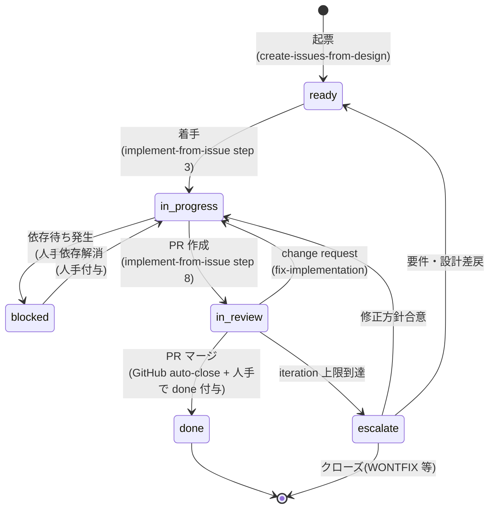

# ⑥ Issue 管理運用

最終更新: 2026-05-27

本文書は、AI 駆動開発における **GitHub Issue** の運用ルールを定義します。`CLAUDE.md` の「チケット管理は GitHub Issues に一本化する」方針を、具体的なラベル体系・状態遷移・レビュー記録・クローズ条件まで落とし込みます。

現状の運用と、空白を埋めるための **拡張提案** を明確に分けて記述します（`現状` / `提案` のラベルで区別）。提案を採用する際は同一 PR で `.github/ISSUE_TEMPLATE/` と `implement-from-issue` skill の更新が必要です。

---

## 1. Issue の位置づけ

開発フロー（[04 §2](04-development-flow.md#2-全体フロー図)）における Issue は次の役割を持つ。

1. **設計と実装の橋渡し**: 採択済み設計書から `/create-issues-from-design` で起票され、`/implement-loop <ISSUE-NUMBER>` への入力になる。
2. **作業単位の最小粒度**: 画面・API リソース・IF・テーブル・バグの 5 種別。
3. **人手レビューの集約点**: PR レビューと採択判断の文脈をすべて Issue / PR コメント上に残す。
4. **トレーサビリティの中継点**: 要件 ID（AC-XXX）↔ 設計書 ↔ 実装 PR を Issue 経由で結ぶ。

---

## 2. 現状サマリ

| 項目 | 現状 |
|------|------|
| テンプレート | `screen.md` / `api.md` / `interface.md` / `table.md` / `bug.md` の 5 種類 |
| Issue 入口 | `blank_issues_enabled: false` でテンプレ強制。`config.yml` で `/create-issues-from-design` 推奨 |
| 自動起票 | `/create-issues-from-design` skill が採択済み設計書から一括起票（採択前は中断） |
| 起票時ラベル | `type:<種別>` + `status:ready` |
| 実装着手 | `/implement-loop <ISSUE-NUMBER>` → `/implement-from-issue` |
| ブランチ規約 | `feature/issue-<N>` |
| コミット規約 | `feat(#N): <title>` 本文 + `Refs: #N` |
| PR テンプレ | `Closes #N` 必須、実装内容・品質チェック結果・関連リンク |
| ステータス更新 | PR 作成時に `status:ready` → `status:in-review`（`implement-from-issue` step 8） |
| クローズ | PR マージで GitHub 標準機能により自動クローズ |
| 重複検出 | 起票前に `gh issue list --search` で近似検索 |

> 出典: `.github/ISSUE_TEMPLATE/`、`.claude/skills/create-issues-from-design/SKILL.md`、`.claude/skills/implement-from-issue/SKILL.md` step 7・8。

---

## 3. Issue 種別とテンプレート

`現状` 5 種類。タイトル規約とラベルは起票時に自動付与される。

| 種別 | テンプレ | タイトル規約 | 起票単位 | 主要セクション |
|------|----------|-------------|----------|----------------|
| 画面 | `screen.md` | `[SCR-XXX] <画面名> 画面の実装` | 画面 1 つ | 画面 ID / 関連設計書 / 入出力 / バリデーション / 画面遷移 / セキュリティ / AC |
| API | `api.md` | `[API] <API 名> の実装` | リソース YAML 1 つ | 関連設計書 / エンドポイント / リクエスト / レスポンス / BR / エラーハンドリング / AC |
| IF | `interface.md` | `[IF] <連携先システム名> の連携実装` | 外部 IF 1 つ | 関連設計書 / 連携先 / I/O 仕様 / エラー処理 / AC |
| DB | `table.md` | `[DB] <テーブル名> テーブルの migration / Entity 実装` | テーブル 1 つ | 関連設計書 / テーブル定義 / カラム / 業務ルール / migration 方針 / AC |
| バグ | `bug.md` | `[BUG] <症状の短い説明>` | バグ 1 件 | 症状 / 再現手順 / 期待 / 実結果 / 環境 / 関連設計書 / AC |

### 3.1 タイトル接頭辞の対応

| 種別 | 接頭辞 |
|------|--------|
| 画面 | `[SCR-XXX]` |
| API | `[API]` |
| IF | `[IF]` |
| DB | `[DB]` |
| バグ | `[BUG]` |

接頭辞の表記揺れは BLOCK 扱い（`[Screen]` / `[api]` 等は不可）。

---

## 4. ラベル体系

### 4.1 種別（`type:*`）— `現状`

| ラベル | 用途 | 自動付与 |
|--------|------|:--------:|
| `type:screen` | 画面 Issue | テンプレ |
| `type:api` | API Issue | テンプレ |
| `type:interface` | IF Issue | テンプレ |
| `type:table` | DB Issue | テンプレ |
| `type:bug` | バグ Issue | テンプレ |

### 4.2 ステータス（`status:*`）— 一部 `現状`、一部 `提案`

| ラベル | 用途 | 状態 | 付与/更新タイミング |
|--------|------|:----:|---------------------|
| `status:ready` | 採択済み・着手可能 | 現状 | 起票時に自動付与 |
| `status:in-progress` | 実装着手中 | **提案** | `implement-from-issue` のブランチ作成時に付与 |
| `status:in-review` | PR レビュー中 | 現状 | PR 作成時（step 8）に更新 |
| `status:blocked` | 依存・調査待ち | **提案** | 依存先 Issue の status:in-review 解除待ち等で人手付与 |
| `status:done` | 検収済み・クローズ可 | **提案** | PR マージ後に人手付与（GitHub の auto-close と併用） |

> ラベルは **1 Issue 1 ステータス**。遷移時に旧ステータスは必ず外す（多重付与禁止）。

### 4.3 優先度（`priority:*`）— `提案`

| ラベル | 意味 | 着手目安 |
|--------|------|----------|
| `priority:p0` | 即時着手（ブロッカー） | 24h 以内 |
| `priority:p1` | 高（次スプリント候補） | 1 週間以内 |
| `priority:p2` | 中（通常） | 既定 |
| `priority:p3` | 低（バックログ） | 余力があれば |

省略時は `priority:p2` 相当として扱う。

### 4.4 レビュー結果（`review:*`）— `提案`

[02 §1](02-review-criteria.md#1-重大度の定義) の重大度を Issue/PR コメント上で可視化するためのラベル。

| ラベル | 意味 |
|--------|------|
| `review:block` | レビューで BLOCK 指摘あり（マージ不可） |
| `review:suggest` | SUGGEST のみ（マージ可） |
| `review:escalate` | iteration 上限到達で人手判断待ち |

PR レビュー完了時に該当ラベルを付け、対応後に外す。`review:escalate` は ESCALATE 発生時に必須。

### 4.5 工程（`phase:*`）— `提案`（任意）

複数フェーズ並行時の視認性向上に使う。標準では使わなくてよい。

| ラベル | 意味 |
|--------|------|
| `phase:backend` | バックエンド主体 |
| `phase:frontend` | フロントエンド主体 |
| `phase:db` | DB 主体 |
| `phase:test` | テスト追加 / カバレッジ改善 |

---

## 5. ステータス遷移ルール

### 5.1 遷移図（`提案` 込みの完全版）



### 5.2 各遷移の責任主体

| 遷移 | 主体 | トリガー |
|------|------|----------|
| `→ ready` | `/create-issues-from-design` | 設計採択 |
| `ready → in_progress` | `/implement-from-issue` | ブランチ作成 |
| `in_progress → blocked` | 人手 | 依存先未完了の判明 |
| `blocked → in_progress` | 人手 | 依存解消 |
| `in_progress → in_review` | `/implement-from-issue` | PR 作成 |
| `in_review → in_progress` | `/fix-implementation` | change request 受領 |
| `in_review → done` | 人手 | PR マージ後の検収完了 |
| `→ escalate` | 人手（or `/implement-loop`） | iteration 上限到達 |

### 5.3 ラベル多重付与の禁止

ステータスラベルは **同時に 1 つだけ** 付与する。skill 側で更新する際は旧ラベルを必ず外す（`gh issue edit --remove-label <旧> --add-label <新>` で同時に行う）。

---

## 6. 依存関係の表現

### 6.1 推奨記法（`提案`）

依存は **Issue 本文の `## 依存関係` セクション** に明記する。

```markdown
## 依存関係

- Depends on: #123, #124   <!-- 完了が前提となる Issue -->
- Blocks: #200             <!-- この Issue が完了しないと進めない Issue -->
- Related: #150            <!-- 影響しあう / 参照しあう Issue -->
```

加えて GitHub の **Linked issues 機能**（"Development" / "Tracked by" / "Linked PRs"）も併用する。本文記述と Linked issues の整合は人手レビューで確認する。

### 6.2 典型的な依存パターン

- `[DB]` → `[API]` → `[SCR-XXX]` の順序（テーブル先行）
- `[API]` → `[E2E]`（実装 → E2E 詳細化）
- バグ修正は対象機能の Issue を `Related` で記載

### 6.3 循環依存の禁止

循環依存（A blocks B, B blocks A）は BLOCK。`/create-issues-from-design` 側で検出して警告する仕様を将来追加する（**TODO**）。

---

## 7. 優先度・見積り・マイルストーン（`提案`）

### 7.1 優先度

[§4.3](#43-優先度priority--提案) のラベルで付与。

- `priority:p0` は週次レビューで必ず棚卸し。長期停留時は人手で起票内容を見直す。
- 優先度はテンプレート本文の `## 優先度` セクションに理由付きで記述（**テンプレ追記 TODO**）。

### 7.2 見積り

GitHub のラベル `estimate:s` / `estimate:m` / `estimate:l` を任意で利用。

| ラベル | 想定規模 |
|--------|----------|
| `estimate:s` | 1 日以内（〜 4h） |
| `estimate:m` | 1〜3 日 |
| `estimate:l` | 1 週間以上（分割を検討） |

`estimate:l` の Issue は **着手前に分割相談** を必須にする。

### 7.3 マイルストーン

スプリント / リリース単位で GitHub Milestone を作成し、`priority:p0/p1` の Issue は必ず紐付ける。`priority:p2/p3` は任意。

---

## 8. アサインの運用（`提案`）

AI 駆動開発では、Issue に対して **「いま誰が触っているか」** が見えにくい。次のルールで補う。

| 状況 | assignee |
|------|----------|
| 起票直後（`status:ready`） | 空 |
| `/implement-from-issue` 実行中（`status:in-progress`） | 実行者（人）を assignee に追加 |
| PR 作成後（`status:in-review`） | レビュア（人）を追加 |
| `status:blocked` | 解消責任者 |
| `status:done` | クローズ実行者 |

`/implement-from-issue` には **「実行者を assignee に追加する」step を追加** することを提案（**skill 改修 TODO**）。

---

## 9. レビュー結果の Issue / PR への記録

### 9.1 AI レビューの記録

`/review-implementation` が出力する JSON（`.skills-state/implement/round-N-review.json`）の要約を、PR のコメントとして自動投稿する（**skill 改修 TODO**）。本文構造:

```markdown
## AI レビュー結果 (round-N)

| 重大度 | 件数 |
| --- | --- |
| BLOCK | X |
| SUGGEST | Y |
| NIT | Z |

### BLOCK 詳細

- [ ] F-001 (<category>): <issue> — suggested_fix: <...>
...
```

### 9.2 人手レビューの記録

人手レビュアは PR コメント先頭に `[BLOCK]` / `[SUGGEST]` / `[NIT]` を付ける。例:

```
[BLOCK] Controller に業務ロジックが残っている。Service に移動してください。
[SUGGEST] 命名を camelCase に統一できそうです。
```

PR の最終判定で `review:block` / `review:suggest` ラベルを付与し、対応完了後に外す。

### 9.3 ESCALATE の記録

iteration 上限到達時、`/implement-loop` は次を実行する（**skill 改修 TODO**）。

1. Issue に `review:escalate` ラベルを付与
2. Issue にコメントで残存 BLOCK の一覧と `.skills-state/implement/state.json` のリンクを投稿
3. status は `in-review` のまま（人手介入で次の遷移を決定）

---

## 10. クローズ条件

### 10.1 通常クローズ（`現状` + `提案`）

1. PR マージで GitHub が **自動クローズ**（`Closes #N` による）。
2. クローズ実行者が Issue に `status:done` を付与し（`提案`）、`status:in-review` を外す。
3. ステークホルダ確認が必要な場合は、`status:done` 付与前に追加コメントで確認待ちを明記する。

### 10.2 WONTFIX / Duplicate クローズ

- `wontfix` ラベルまたは `duplicate` ラベルを付与
- 理由を必ずコメントで明記
- バグ Issue の場合、再発防止策（テスト追加など）が不要であることの根拠を残す

### 10.3 自動クローズの落とし穴

- **マージしたが検収が通っていない** ケースで自動クローズされる。`status:done` を別途付与する運用で「検収済み」と区別する。
- **ブランチを誤って削除した** 場合に再オープン手順を明記しておく（**TODO**）。

---

## 11. テンプレート拡張提案

既存テンプレートに次のセクションを追加する（**`.github/ISSUE_TEMPLATE/*.md` 改修 TODO**）。共通項目として全 5 種に追加。

### 11.1 共通追加セクション

```markdown
## 依存関係

- Depends on: #
- Blocks: #
- Related: #

## 優先度

- `priority:p?`（理由: <...>）

## 見積り

- `estimate:?`
```

### 11.2 種別固有の追加（任意）

- 画面 / API / IF / DB: テスト戦略への参照（「`docs/test/単体テストマトリクス.md` 該当行」「`docs/test/E2Eシナリオ.md` 該当シナリオ ID」）
- バグ: `severity:sev1/sev2/sev3` のラベル運用検討

---

## 12. skill 側の変更提案

`提案` を反映するために、以下の skill を更新する必要がある。本文書を採択する PR で同時に対応する。

| skill | 変更内容 |
|-------|----------|
| `create-issues-from-design` | テンプレート拡張に伴う本文生成ロジック更新。優先度・依存関係セクションの記入 |
| `implement-from-issue` | step 3 で `status:ready` → `status:in-progress` 更新。step 3 で assignee に実行者追加 |
| `implement-loop` | iteration 上限到達時に `review:escalate` ラベル付与とコメント投稿 |
| `review-implementation` | PR コメントへの JSON サマリ投稿 |
| `fix-implementation` | PR review コメントの `[BLOCK]` / `[SUGGEST]` を解釈して対応対象を選別 |

---

## 13. ノウハウ集

### N-01: 「ステータスラベルは『1 個だけ』」

複数の `status:*` が同時に付くと、検索フィルタが壊れて並行作業の見える化が破綻する。skill 側で完全置換（旧ラベル削除 + 新ラベル追加）を必ず行う。

### N-02: 「assignee は『今動いている人』」

「実装した人」ではなく「今この Issue で何かしている人」を示す。レビュー中はレビュアに、依存待ちなら解消責任者に。これだけで「誰が止めているか」が一目で分かる。

### N-03: 「依存関係は本文 + Linked issues の二重記録」

本文の `## 依存関係` は読みやすさのため、Linked issues は GitHub の検索・通知のため。両方を整合させる。AI が起票するときは両方を埋める。

### N-04: 「`priority:p0` は週次で必ず棚卸し」

放置されると優先度ラベルの意味が崩壊する。週次で全 `priority:p0` を確認し、解消・降格・分割のいずれかを決める。

### N-05: 「AI レビュー結果は PR コメントに残す」

`.skills-state/` は gitignore 対象でローカルにしかない。後から「なぜ BLOCK だったか」を追えるよう、PR コメントとして JSON サマリを残す（[§9.1](#91-ai-レビューの記録)）。

### N-06: 「Issue 本文に AC を残し続ける」

実装後に AC セクションを削除しない。`- [x]` でチェック済みにして残す。検収時に「何が満たされたか」が一目で分かる。

### N-07: 「ESCALATE の半分は AC 不足」

実装が iteration 上限まで回るのは「AC が定量化されていない」「業務ルールに穴がある」ケースが多い。`review:escalate` を見たらまず要件側の解像度を疑う（[05-test-process.md N-09](05-test-process.md#11-ノウハウ集) と同じ視点）。

### N-08: 「重複検出は『起票前』」

`/create-issues-from-design` は `gh issue list --search` で近似検索する。これを skip すると同じ画面に複数 Issue が立つ。タイトル接頭辞の規約があるので、検索クエリは `[SCR-XXX]` で前方一致する。

### N-09: 「クローズと検収を区別する」

`Closes #N` で自動クローズすると「マージ済み = 検収済み」に見えるが、実環境での動作確認が未済の場合がある。`status:done` を別途付与する運用で線を引く。

### N-10: 「テンプレ拡張は加算型」

既存テンプレに項目を追加するときは、既存項目を消さない。古い Issue を読むときに項目の位置が変わると認知負荷が高い。

---

## 14. アンチパターン

| # | アンチパターン | 代わりにすべきこと |
|---|----------------|--------------------|
| I1 | 1 Issue に複数画面 / 複数 API を詰める | 種別ごとに 1 Issue（API はリソース YAML 単位は許容） |
| I2 | `status:*` を複数同時に付ける | 1 つだけ。skill は完全置換 |
| I3 | 依存を本文に書かず口頭・チャットだけ | 本文の `## 依存関係` + Linked issues に二重記録 |
| I4 | `Closes #N` を忘れる | PR テンプレで必須。skill 側で自動付与済 |
| I5 | クローズだけで検収せず放置 | `status:done` で検収完了を明示 |
| I6 | テンプレを外して自由記述 Issue を立てる | `blank_issues_enabled: false` で防御済。突破しない |
| I7 | AI レビュー結果を Issue / PR に残さない | PR コメントに JSON サマリを投稿 |
| I8 | assignee 空のまま長期放置 | 着手と同時に追加 |
| I9 | 同一バグに複数 Issue が並列起票 | 起票前の重複検出。1 つに統合し他は duplicate で閉じる |
| I10 | 優先度ラベルを付けるだけで棚卸ししない | 週次で `priority:p0` を必ず確認 |

---

## 15. 関連文書

- [README.md](README.md) — 索引
- [01-prompt-rules.md](01-prompt-rules.md) — Issue 関連 skill のプロンプト規約
- [02-review-criteria.md](02-review-criteria.md) — `review:*` ラベルの根拠
- [03-ai-usage-scenes.md](03-ai-usage-scenes.md) — Issue 起票・実装の関与度
- [04-development-flow.md](04-development-flow.md) — Phase 3（Issue 起票）と Phase 4（実装）の位置
- [05-test-process.md](05-test-process.md) — テスト関連 Issue（任意）の取り扱い
- `CLAUDE.md` — チケット管理の一元化方針
- `.github/ISSUE_TEMPLATE/` — 起票テンプレートの正本
- `.claude/skills/create-issues-from-design/SKILL.md` — 起票 skill
- `.claude/skills/implement-from-issue/SKILL.md` — 実装 skill（ステータス更新含む）

---

## 16. 採択時の TODO 一覧（参考）

本文書の `提案` を採択する場合、以下を別 PR で対応する想定。

- [ ] `.github/labels.yml` または手動でラベルを作成: `status:in-progress` / `status:blocked` / `status:done` / `priority:p0..p3` / `review:block` / `review:suggest` / `review:escalate`（必要に応じて `phase:*` / `estimate:*` も）
- [ ] `.github/ISSUE_TEMPLATE/*.md` に共通追加セクション（依存関係・優先度・見積り）を追記
- [ ] `create-issues-from-design` を更新（テンプレート拡張対応）
- [ ] `implement-from-issue` を更新（status:in-progress 遷移、assignee 追加）
- [ ] `implement-loop` を更新（review:escalate 付与、ESCALATE コメント投稿）
- [ ] `review-implementation` を更新（PR コメント投稿）
- [ ] 既存 Issue の遡及対応方針を決める（既存は据え置きか、棚卸し時に更新か）

---

## 17. マルチリポジトリ + GitHub Projects 運用（gh CLI 一本化）— `提案`

リポジトリを **フロントエンド / バックエンド / バッチ の別リポジトリ**に分割する方針（`docs/process/リポジトリ構成と移行計画.md`）に伴い、Issue 運用を次のとおり更新する。本節は単一リポジトリ前提だった §1〜§16 を上書きする。

### 17.1 基本方針

- **Issue は各コードリポジトリに起票し（分散）、GitHub Projects v2 で横串集約する。** Issue が PR と同じ repo にあるため `Closes #N` の自動クローズが自然に効く。複数 repo の Issue/PR を1つの Project に集約して可視化・追跡する。
- **Issue / PR / Project の操作は `gh` CLI に一本化する**（`mcp__github__*` は使わない）。理由: `--repo` でのマルチ repo 振り分けと Projects v2（GraphQL ベース）を一貫して扱えるのは `gh` のみ。

### 17.2 リポジトリ振り分け

> 振り分けは**仮**（後で修正の可能性あり）。リポジトリ構成は 6 リポジトリ（FE / BE / バッチ / E2E / ドキュメント=docs / 親=AIルール）を前提とする（詳細・移行は `docs/process/リポジトリ構成と移行計画.md`）。

| 設計成果物 / Issue 種別 | 起票先 repo |
|---|---|
| 画面（`[SCR-XXX]` / type:screen） | フロントエンド |
| API（`[API]` / type:api）・DB（`[DB]` / type:table） | バックエンド |
| バッチ（**新設**: `[BATCH]` / type:batch）・物理削除（BR-013）等 | バッチ |
| E2E（**新設**: `[E2E]` / type:e2e）シナリオ実装 | E2E |
| 要件・設計タスク（`[REQ]` / `[DESIGN]`）・エピック | ドキュメント（docs） |
| ルール / 開発フロー / skill 変更 | 親（AIルール） |
| 外部 IF（`[IF]` / type:interface） | 連携の主担当 repo |
| バグ（`[BUG]`） | 当該 repo |

> バッチ用（`batch.md`）・E2E 用（`e2e.md`）の Issue 種別・テンプレートは現状未整備。追加が必要（§17.6 TODO）。

### 17.3 ラベル・マイルストーン・依存・追跡

- **ラベルは repo ごとに複製**（`gh label create --repo`）。GitHub のラベルは repo 単位のため。
- **横断ステータス / 優先度 / スプリント**は Project に寄せる：Project の組み込み **Status** フィールド、`priority` 単一選択フィールド、**Iteration** フィールド（マイルストーンは repo をまたげないため Iteration で代替）。
- **依存関係はクロス repo 記法** `owner/repo#123`（`[DB/API](BE) → [SCR](FE)` は repo をまたぐ）。
- **トレーサビリティ**: Project のカスタムフィールド（`AC-XXX` / `SCR-XXX` / `module`）で repo 横断集計し、`docs/test/トレーサビリティマトリクス.md` は Issue/PR を `owner/repo#N` で参照する。

### 17.4 gh コマンド対応表

| 操作 | gh コマンド（概略） |
|---|---|
| 起票 | `gh issue create --repo <owner>/<repo> --title ... --body ... --label ...` |
| 重複検索（冪等） | `gh issue list --repo <owner>/<repo> --search "[SCR-XXX] in:title"` |
| 本文更新 | `gh issue edit <n> --repo <owner>/<repo> --body ...` |
| Project へ追加 | `gh project item-add <project-number> --owner <owner> --url <issue-url>` |
| Project フィールド更新 | `gh project item-edit --id <item-id> --project-id <pid> --field-id <fid> ...` |
| Project 項目一覧（冪等確認） | `gh project item-list <project-number> --owner <owner>` |
| ラベル複製 | `gh label create <name> --repo <owner>/<repo> --color ... --description ...` |
| PR 作成 | `gh pr create --repo <owner>/<repo> --base <main> --head <feature> --fill` |
| PR マージ | `gh pr merge <n> --repo <owner>/<repo> --squash`（`--admin` は禁止＝deny/フック） |

### 17.5 前提・ガードレール

- **トークンスコープ**: Projects v2 操作には `project` 権限が必要（classic PAT は `project` スコープ、fine-grained PAT は Organization の **Projects: Read/Write**）。現行 PAT（Contents / Issues / Pull requests R/W, Metadata R）に **Projects 権限の追加が必須**。
- **実行環境**: `gh` のインストールと認証（`gh auth login` または `GH_TOKEN`）が前提。
- **破壊的 gh の機械ブロック（対応済み）**: `gh repo delete` / `gh pr merge --admin` / `gh api -X DELETE` / `gh secret set|delete` / `gh release delete` / `gh project delete` / `gh ssh-key|gpg-key delete` / `gh label delete` / `gh auth logout` を `settings.json` の deny と `block-secrets.sh`（位置非依存）の両方でブロック済み。

### 17.6 スキル改修 TODO（§12 を更新）

- `create-issues-from-design`: `gh` 化、repo 振り分け（§17.2）、起票後の **Project 追加 + フィールド設定**、バッチ種別・`batch.md` テンプレ追加。
- `implement-from-issue`: **対象 repo の判定**（Issue の repo で作業）、`gh` 化、PR 作成・ステータス更新を Project の Status フィールドへ。
- `fix-implementation` / `review-implementation`: `gh` 化（PR コメント・ステータスを `gh` 経由に）。
- `.github/ISSUE_TEMPLATE/` とラベル: 各 repo に複製、`type:batch` 追加。
- 本書 §2〜§5 の「現状」表を gh / マルチ repo 前提に更新。
